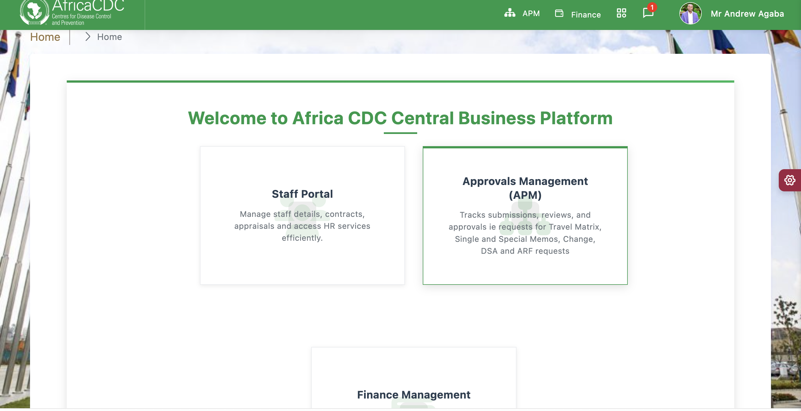
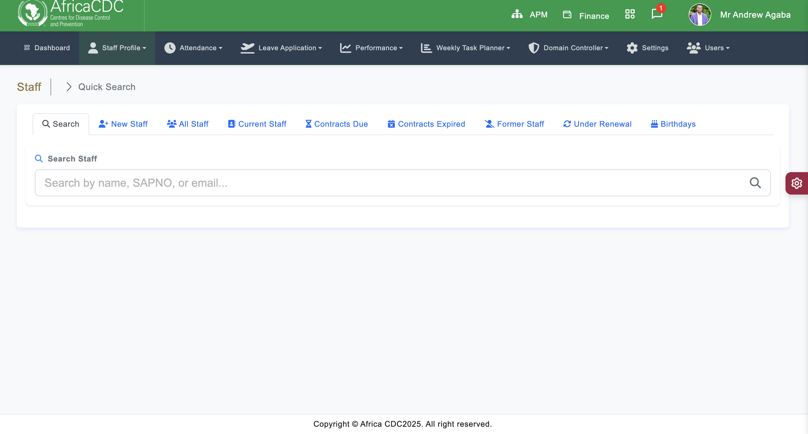
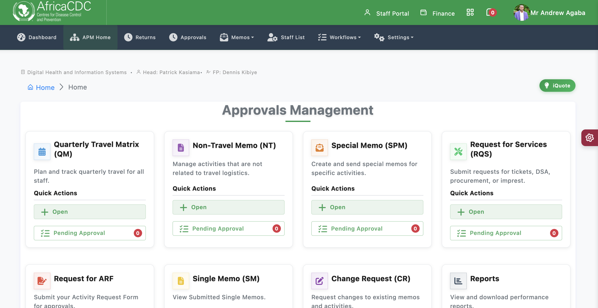
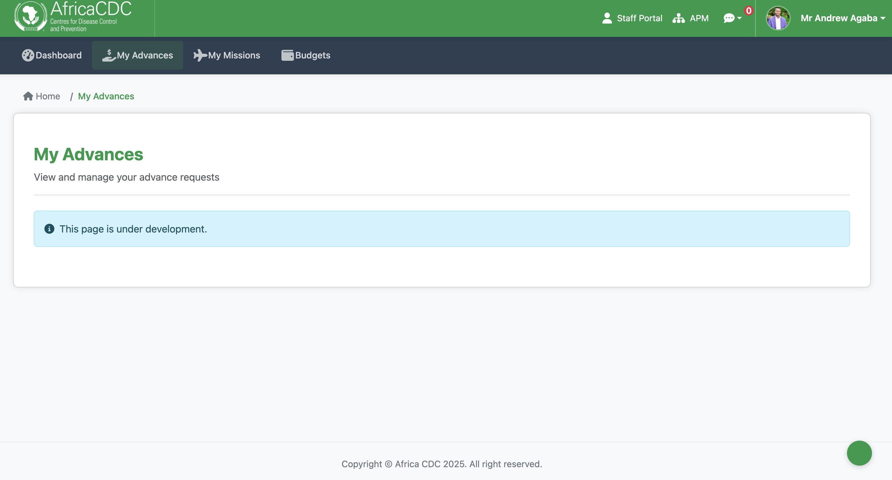

<div align="center">

# 🌍 Africa CDC CBP
## Central Business Platform

**Africa CDC Staff Portal & Matrix Approval Management System**



[](./documentation/README.md)
[](./application/)
[](./apm/)
[](./finance/)

</div>

---

## 📋 Overview

The **Africa CDC Central Business Platform (CBP)** is a centralized platform designed to manage staff information, monitor task progress, and streamline approvals across divisions. It enables efficient performance tracking, leave management, and weekly activity planning to support organizational goals.

Integrated with the Matrix Approval Management module, the system ensures structured oversight of planned activities and budget allocations. Division focal persons can submit quarterly matrices outlining key deliverables, which then follow a defined multi-level approval workflow involving directors and senior management.

This system enhances **transparency**, **accountability**, and **timely decision-making** across Africa CDC's internal operations.

---

## 🏗️ System Architecture

The platform consists of three integrated modules working seamlessly together:

<div align="center">

### 🎯 Platform Modules

<table>
<tr>
<td align="center" width="33%">

### 👥 Staff Portal
**CodeIgniter-based Core System**



**Features:**
- ✅ User authentication & session management
- ✅ Staff profiles & directory
- ✅ Permission management
- ✅ Base infrastructure for all modules

[📖 Documentation](./application/) | [⚙️ Config](./assets/ENVIRONMENT_VARIABLES.md)

</td>
<td align="center" width="33%">

### 📋 APM
**Approvals Management System**



**Features:**
- ✅ Approval workflows & matrices
- ✅ Document processing & numbering
- ✅ Budget approvals
- ✅ Activity tracking

[📖 Documentation](./apm/documentation/) | [🚀 Quick Start](./apm/README.md)

</td>
<td align="center" width="33%">

### 💰 Finance Module
**Modern Finance Management**



**Features:**
- ✅ Staff advances
- ✅ Mission budgets
- ✅ Financial tracking
- ✅ Budget management

[📖 Documentation](./finance/documentation/) | [🚀 Quick Start](./finance/README.md)

</td>
</tr>
</table>

</div>

---

## 🚀 Quick Start

### 👨‍💻 For Developers

<details>
<summary><b>1. Set up Staff Portal (CodeIgniter)</b></summary>

- Configure database in `application/config/database.php`
- Review [Environment Variables](./assets/ENVIRONMENT_VARIABLES.md)
- Set up authentication and permissions

</details>

<details>
<summary><b>2. Set up APM Module (Laravel)</b></summary>

```bash
cd apm
composer install
cp .env.example .env
php artisan key:generate
php artisan migrate
php artisan db:seed
```

📖 See [APM Documentation](./apm/documentation/README.md) for details.

</details>

<details>
<summary><b>3. Set up Finance Module (Node.js/React)</b></summary>

```bash
cd finance
npm run install:all
npm run dev:all
```

📖 See [Finance Documentation](./finance/documentation/README.md) for details.

</details>

### 🔧 For System Administrators

<details>
<summary><b>Production Deployment</b></summary>

1. Review [APM Deployment Guide](./apm/documentation/DEPLOYMENT.md)
2. Configure reverse proxy (see Finance docs)
3. Set up queue workers and cron jobs
4. Configure [Queue Setup](./apm/documentation/QUEUE_SETUP_GUIDE.md)
5. Set up [Cron Configuration](./apm/documentation/CRON_SETUP.md)

</details>

---

## 📚 Documentation

<div align="center">

| 📖 Documentation | 📝 Description |
|-----------------|----------------|
| [**📚 Main Documentation Hub**](./documentation/README.md) | Central documentation for the entire platform |
| [**👥 Staff Portal Docs**](./assets/ENVIRONMENT_VARIABLES.md) | Configuration and setup guides |
| [**📋 APM Documentation**](./apm/documentation/README.md) | Laravel Approvals Management System |
| [**💰 Finance Documentation**](./finance/documentation/README.md) | Node.js/React Finance Module |

</div>

### 🔑 Key Guides

**Infrastructure & Setup:**
- [Environment Variables](./assets/ENVIRONMENT_VARIABLES.md) - Configuration guide
- [APM Queue Setup](./apm/documentation/QUEUE_SETUP_GUIDE.md) - Queue worker configuration
- [Systemd Queue Guide](./apm/documentation/SYSTEMD_QUEUE_GUIDE.md) - Systemd queue management
- [Cron Configuration](./apm/documentation/CRON_SETUP.md) - Scheduled tasks
- [Database Backup System](./apm/README_BACKUP.md) - Automatic database backups and retention policies

**Architecture & Development:**
- [Finance Frontend Architecture](./finance/documentation/FRONTEND_ARCHITECTURE.md) - React app structure
- [Finance Server Architecture](./finance/documentation/SERVER_ARCHITECTURE.md) - Node.js server structure
- [Auth Module Improvements](./application/modules/auth/README_IMPROVEMENTS.md) - Authentication features

---

## 🔗 Integration

All modules are seamlessly integrated through:

<div align="center">

| 🔐 **Session Management** | 🧭 **Navigation** | 🔒 **Permissions** |
|---------------------------|-------------------|-------------------|
| Shared authentication via Staff Portal | Cross-module navigation with token-based session transfer | Unified permission system across all modules |

</div>

See [documentation/README.md](./documentation/README.md) for detailed integration information.

---

## 📂 Project Structure

```
staff/
├── 📄 README.md                    # This file
├── 📚 documentation/               # Main documentation hub
│   └── README.md                  # Central documentation index
├── 👥 application/                 # CodeIgniter Staff Portal
│   ├── modules/                   # Application modules
│   └── config/                    # Configuration files
├── 📋 apm/                        # Laravel APM module
│   ├── app/                       # Laravel application
│   ├── documentation/             # APM documentation
│   └── README.md                  # APM main README
├── 💰 finance/                    # Node.js/React Finance module
│   ├── server/                    # Express.js backend
│   ├── frontend/                  # React frontend
│   ├── documentation/             # Finance documentation
│   └── README.md                  # Finance main README
├── 🎨 assets/                     # Shared assets
│   └── images/                    # Images and graphics
└── ⚙️ system/                     # CodeIgniter system files
```

---

## 🎯 Features

<div align="center">

| ✨ Feature | 📋 Description |
|-----------|----------------|
| 🔐 **Unified Authentication** | Single sign-on across all modules |
| 📊 **Approval Workflows** | Multi-level approval processes |
| 💰 **Financial Management** | Advances, budgets, and tracking |
| 👥 **Staff Management** | Profiles, contracts, and HR services |
| 📈 **Performance Tracking** | Task monitoring and reporting |
| 🔔 **Notifications** | Real-time alerts and updates |

</div>

---

## 🛠️ Technology Stack

<div align="center">

| Module | Backend | Frontend | Database |
|--------|---------|----------|----------|
| **Staff Portal** | CodeIgniter 3 | Bootstrap 5 | MySQL |
| **APM** | Laravel 10+ | Blade Templates | MySQL |
| **Finance** | Node.js/Express | React 18 | MySQL |

</div>

---

## 📞 Support

For issues or questions:

1. 📖 Check the relevant module documentation
2. 🔍 Review [Main Documentation Hub](./documentation/README.md)
3. 📋 Check application logs
4. 🐛 Review troubleshooting guides

---

<div align="center">

**Version**: 1.0.0  
**Last Updated**: 2024

---

Made with ❤️ for Africa CDC

[⬆ Back to Top](#-africa-cdc-cbp)

</div>
