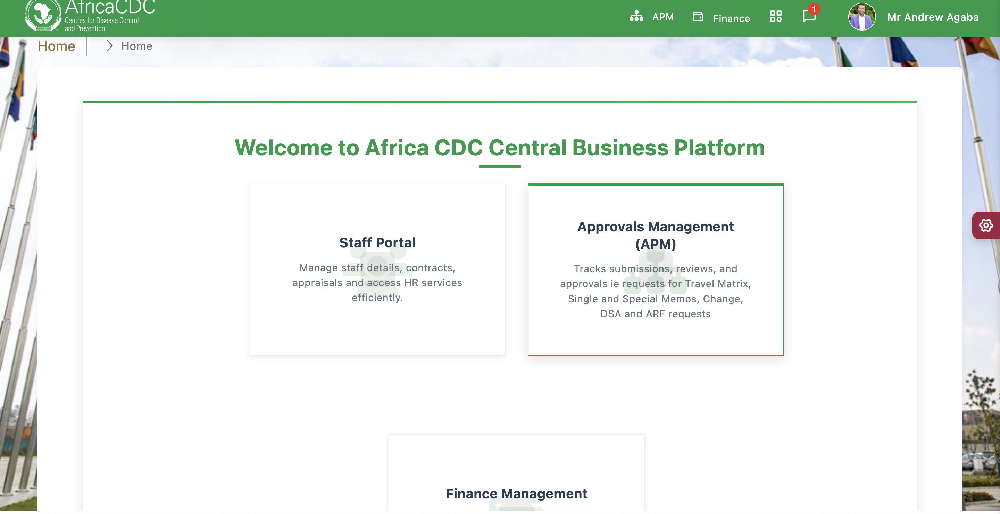
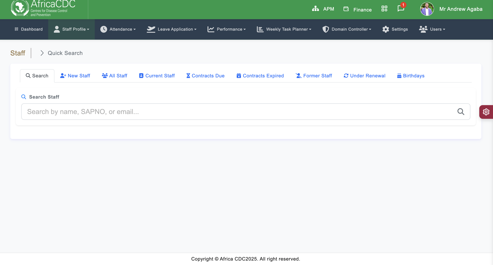
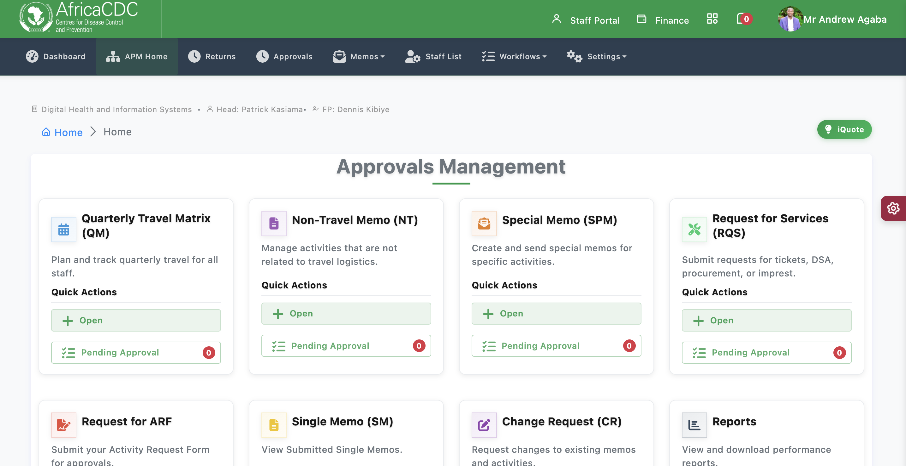
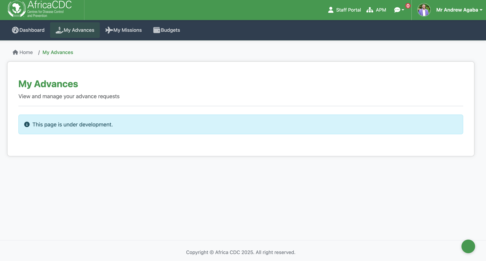

<div align="center">

# 🌍 Africa CDC CBP
## Central Business Platform

**Africa CDC Staff Portal & Matrix Approval Management System**



[](./documentation/README.md)
[](./modules/staff-portal/)
[](./modules/apm/)
[](./modules/finance/)
[](./modules/helpdesk/)

</div>

---

## 📋 Overview

The **Africa CDC Central Business Platform (CBP)** is a centralized platform designed to manage staff information, monitor task progress, and streamline approvals across divisions. It enables efficient performance tracking, leave management, and weekly activity planning to support organizational goals.

Integrated with the Matrix Approval Management module, the system ensures structured oversight of planned activities and budget allocations. Division focal persons can submit quarterly matrices outlining key deliverables, which then follow a defined multi-level approval workflow involving directors and senior management.

This system enhances **transparency**, **accountability**, and **timely decision-making** across Africa CDC's internal operations.

**Repository layout:** CBP apps live under `modules/{staff-portal,apm,finance,helpdesk}`. Public URLs stay `/staff/`, `/staff/backend`, `/staff/apm`, `/staff/finance`, and `/staff/helpdesk` (Apache maps these into `modules/`; there is no root `backend` symlink).

---

## 🏗️ System Architecture

The platform consists of four integrated modules working seamlessly together:

<div align="center">

### 🎯 Platform Modules

<table>
<tr>
<td align="center" width="25%">

### 👥 Staff Portal
**Laravel + Vue SPA**



**Features:**
- ✅ User authentication & session management
- ✅ Staff profiles & directory
- ✅ Permission management
- ✅ Base infrastructure for all modules

[📖 Module](./modules/staff-portal/README.md) | [⚙️ Config](./assets/ENVIRONMENT_VARIABLES.md) | [📡 Share API](./modules/staff-portal/backend/Modules/Share/README.md)

</td>
<td align="center" width="25%">

### 📋 APM
**Approvals Management System**



**Features:**
- ✅ Approval workflows & matrices
- ✅ Document processing & numbering
- ✅ Budget approvals
- ✅ Activity tracking
- ✅ **REST API** (JWT) – pending approvals, documents with approval trails & attachment URLs, actions, memo list

[📖 Documentation](./modules/apm/documentation/) | [📡 API Docs](./modules/apm/documentation/API_DOCUMENTATION.md) | [🚀 Quick Start](./modules/apm/README.md)

</td>
<td align="center" width="25%">

### 💰 Finance Module
**Modern Finance Management**



**Features:**
- ✅ Staff advances
- ✅ Mission budgets
- ✅ Financial tracking
- ✅ Budget management

[📖 Documentation](./modules/finance/documentation/) | [🚀 Quick Start](./modules/finance/README.md)

</td>
<td align="center" width="25%">

### 🛎️ Helpdesk
**Service Desk & ITSM**

**Features:**
- ✅ Ticketing (web, WhatsApp, Teams sources)
- ✅ SLA targets, agent routing, AI signals
- ✅ Knowledge base + searchable FAQs
- ✅ Agent desk, reassignment, reports
- ✅ Public TV / lobby dashboard (no auth, no PII)
- ✅ ISO 27001 / 27014 audit logging

[📖 Documentation](./modules/helpdesk/documentation/README.md) | [👤 User Guide](./modules/helpdesk/documentation/USER_GUIDE.md) | [🧑‍💻 Developer Guide](./modules/helpdesk/documentation/DEVELOPER_GUIDE.md) | [🚀 Quick Start](./modules/helpdesk/README.md)

</td>
</tr>
</table>

</div>

---

## 🚀 Quick Start

### 👨‍💻 For Developers

```bash
./setup.sh   # interactive env for all modules (+ optional installers / systemd)
```

Full guide: [docs/SETUP.md](./docs/SETUP.md)

<details>
<summary><b>Docker (CBP modules)</b></summary>

- Full guide: [docker/README.md](./docker/README.md)
- Requires Docker Desktop or Docker Engine running (fix “Cannot connect to the Docker daemon” by starting Docker).
- Compose vars live in `docker/.env` (do not overwrite the repo-root `.env`). Redis runs in Compose; MySQL defaults to the physical host (`DB_HOST=host.docker.internal` in each module `.env`).
- The `web` image includes **Ghostscript**, **Poppler**, and **LibreOffice** for APM PDF annex embedding. Rebuild after updates: `docker compose --env-file docker/.env up -d --build`.

```bash
cp docker/compose.env.example docker/.env
docker compose --env-file docker/.env up -d --build
```

- Staff portal: `http://localhost:8080/staff/` · Backend: `/staff/backend/up` · APM: `/staff/apm/` · Finance: `/staff/finance/` · Helpdesk: `/staff/helpdesk/`

</details>

<details>
<summary><b>1. Set up Staff Portal (Laravel + Vue)</b></summary>

```bash
cd modules/staff-portal
# Backend API
cd backend && cp .env.example .env && composer install && php artisan key:generate
# SPA
cd ../frontend && npm ci --legacy-peer-deps && npm run build
cd .. && ./scripts/publish-spa.sh
```

📖 See [modules/staff-portal/README.md](./modules/staff-portal/README.md) for details.

</details>

<details>
<summary><b>2. Set up APM Module (Laravel)</b></summary>

```bash
cd modules/apm
composer install
cp .env.example .env
php artisan key:generate
php artisan migrate
php artisan db:seed
```

📖 See [APM Documentation](./modules/apm/documentation/README.md) for details.

</details>

<details>
<summary><b>3. Set up Finance Module (Laravel + Inertia)</b></summary>

```bash
cd modules/finance
./setup.sh
```

📖 See [Finance Documentation](./modules/finance/documentation/README.md) for details.

</details>

<details>
<summary><b>4. Set up Helpdesk Module (Laravel + Vue)</b></summary>

```bash
cd modules/helpdesk
./setup.sh
# Backend
cd backend && composer install \
  && cp .env.example .env \
  && php artisan key:generate \
  && php artisan migrate --seed
# Frontend (built SPA served by Apache at /staff/helpdesk/)
cd ../frontend && npm install --cache ./.npm-cache --legacy-peer-deps \
  && npm run build
```

Smoke-test:

```bash
curl -i http://localhost/staff/helpdesk/                                # SPA
curl -i http://localhost/staff/helpdesk/backend/api/v1/health           # API
curl -i http://localhost/staff/helpdesk/backend/api/v1/public/screen    # Public TV dashboard
```

📖 See [Helpdesk Documentation](./modules/helpdesk/documentation/README.md) (start with the [User Guide](./modules/helpdesk/documentation/USER_GUIDE.md) or [Developer Guide](./modules/helpdesk/documentation/DEVELOPER_GUIDE.md)).

</details>

### 🔧 For System Administrators

<details>
<summary><b>Production Deployment</b></summary>

1. Review [APM Deployment Guide](./modules/apm/documentation/DEPLOYMENT.md)
2. Configure reverse proxy (see Finance docs)
3. Set up queue workers and cron jobs
4. Configure [Queue Setup](./modules/apm/documentation/QUEUE_SETUP_GUIDE.md)
5. Set up [Cron Configuration](./modules/apm/documentation/CRON_SETUP.md)
6. Configure Staff Portal scheduler (Laravel):

```bash
* * * * * cd /path/to/staff/modules/staff-portal/backend && php artisan schedule:run >> /dev/null 2>&1
```

(Plus APM / Helpdesk schedule entries as documented in each module.)

</details>

---

## 📚 Documentation

<div align="center">

| 📖 Documentation | 📝 Description |
|-----------------|----------------|
| [**📚 Main Documentation Hub**](./documentation/README.md) | Central documentation for the entire platform |
| [**👥 Staff Portal Docs**](./modules/staff-portal/README.md) | Laravel + Vue setup, Share API, deploy |
| [**📋 APM Documentation**](./modules/apm/documentation/README.md) | Laravel Approvals Management System |
| [**📡 APM API Documentation**](./modules/apm/documentation/API_DOCUMENTATION.md) | REST API (JWT), endpoints, approval trails, attachments, Swagger at `/docs` |
| [**🌱 APM Environment Guide**](./modules/apm/documentation/ENVIRONMENT.md) | `.env` setup and variable reference (`modules/apm/.env.example`) |
| [**💰 Finance Documentation**](./modules/finance/documentation/README.md) | Laravel + Inertia Finance Module |
| [**🛎️ Helpdesk Documentation**](./modules/helpdesk/documentation/README.md) | Service Desk / ITSM module (Laravel + Vue) — index of all helpdesk docs |
| [**👤 Helpdesk User Guide**](./modules/helpdesk/documentation/USER_GUIDE.md) | Requesters, agents & admins; includes step-by-step ticket creation |
| [**🧑‍💻 Helpdesk Developer Guide**](./modules/helpdesk/documentation/DEVELOPER_GUIDE.md) | Architecture, schema, REST API, extension points & runbooks |
| [**💾 File storage (uploads)**](./docs/STORAGE.md) | Host-side uploads, migration scripts, CI cache permissions, Knowledge Hub UI |
| [**🔁 CI (GitHub + Azure)**](./docs/CI.md) | Build gates and GHCR image publish |
| [**🛠️ Root setup**](./docs/SETUP.md) | Interactive env + installers + systemd |

</div>

### 🔑 Key Guides

**APM API (integrations & approver apps):**
- [APM API Documentation](./modules/apm/documentation/API_DOCUMENTATION.md) - Auth, endpoints, approval trails, attachments, examples
- [OpenAPI/Swagger spec](./modules/apm/documentation/APM_API_OPENAPI.yaml) - Full request/response schemas; interactive docs at `/docs` when APM is running

**Infrastructure & Setup:**
- [File storage & uploads](./docs/STORAGE.md) - Host-side storage (`/var/staffdata`), migration scripts, git-safe uploads
- [Environment Variables](./assets/ENVIRONMENT_VARIABLES.md) - Configuration guide
- [APM Environment Guide](./modules/apm/documentation/ENVIRONMENT.md) - `.env` setup and examples
- [APM Queue Setup](./modules/apm/documentation/QUEUE_SETUP_GUIDE.md) - Queue worker configuration
- [Systemd Queue Guide](./modules/apm/documentation/SYSTEMD_QUEUE_GUIDE.md) - Systemd queue management
- [Cron Configuration](./modules/apm/documentation/CRON_SETUP.md) - Scheduled tasks
- [Database Backup System](./modules/apm/README_BACKUP.md) - Automatic database backups and retention policies

**Operations (Staff Portal jobs):**
- `php index.php jobs/run/tick` - single entry-point scheduler for recurring jobs
- `php index.php jobs/run/performance_notifications` - queue PPA/Midterm/Endterm reminder emails
- `php index.php jobs/run/performance_approval_reminder` - queue + send daily performance approval reminder

**Architecture & Development:**
- [Finance Quick Start](./modules/finance/documentation/QUICKSTART.md) - Install and SSO
- [Finance Laravel + Inertia](./modules/finance/documentation/LARAVEL_INERTIA.md) - UI and adding pages
- [CI (GitHub + Azure)](./docs/CI.md) - Build gates and GHCR image publish
- [Docker](./docker/README.md) - Local Compose stack (web + Redis)

---

## 🔗 Integration

All modules are seamlessly integrated through:

<div align="center">

| 🔐 **Session Management** | 🧭 **Navigation** | 🔒 **Permissions** |
|---------------------------|-------------------|-------------------|
| Shared Staff portal auth; POST SSO launch; background JWT refresh (`cbp-session-refresh.js`) across APM, Helpdesk, and Finance | CBP Modules menu with secure `home/launch_module` hand-off | Unified permission system across all modules |

</div>

See [documentation/README.md](./documentation/README.md) for detailed integration information.

---

## 📂 Project Structure

Public URLs (`/staff/…`) are mapped by root `.htaccess` into `modules/…` (no root `backend` symlink).

```
staff/
├── README.md                            # This file
├── .htaccess                            # Rewrites /staff/{backend,apm,finance,helpdesk} → modules/
├── index.php                            # Thin front controller for the staff mount
├── azure-pipelines.yml                  # Azure CI + GHCR publish
├── docker-compose.yml                   # Local web + Redis (+ optional workers / MySQL)
├── docker-compose.prod.yml              # Prod-ish overrides (bake image, no bind-mount)
├── .github/workflows/ci.yml             # GitHub Actions CI + GHCR publish
│
├── docker/                              # CBP Docker image & Apache vhost
│   ├── Dockerfile                       # PHP 8.2 Apache; targets runtime | prod
│   ├── entrypoint.sh                    # Redis wait; Laravel storage perms
│   ├── apache/000-staff.conf            # Alias /staff → /var/www/staff
│   ├── compose.env.example              # → docker/.env (Compose vars only)
│   ├── mysql/init/                      # Bundled-db schema bootstrap
│   └── README.md                        # Docker operator guide
│
├── docs/
│   ├── CI.md                            # GHA + Azure + GHCR setup
│   ├── STORAGE.md                       # Host-side uploads / permissions
│   └── superpowers/                     # Design specs & implementation plans
│
├── documentation/                       # Platform documentation hub
│   └── README.md
│
├── scripts/
│   ├── ci/                              # Shared CI: composer-modules, build-spa, docker-publish
│   ├── migrate-to-modules-layout.sh     # One-shot: root apps → modules/ (+ optional --clean)
│   ├── storage/                         # migrate-*.sh, fix-staff-storage-permissions.sh
│   ├── fix-laravel-storage-permissions.sh
│   └── production-sync-from-git.sh
│
├── shared/                              # Cross-app PHP helpers
│   ├── StaffStorage.php                 # Shared upload path resolver
│   └── fix-public-script-name.php       # SCRIPT_NAME remap after Apache rewrites
│
├── modules/                             # CBP applications (canonical app roots)
│   ├── staff-portal/                    # Staff Portal — Laravel API + Vue SPA
│   │   ├── backend/                     # Laravel 12 API (/staff/backend)
│   │   │   └── Modules/                 # nwidart modules (Share, Auth, Staff, Leave, …)
│   │   ├── frontend/                    # Vue 3 + Vite SPA source
│   │   ├── public-spa/                  # Published SPA (via scripts/publish-spa.sh)
│   │   ├── spa-static.php               # Serves hashed SPA assets under /staff/assets/
│   │   └── scripts/publish-spa.sh
│   ├── apm/                             # Approvals Management — Laravel
│   │   ├── app/                         # Controllers, Models, Services, Commands
│   │   ├── routes/                      # api.php, web.php (/docs Swagger)
│   │   ├── public/                      # App web root (/staff/apm)
│   │   └── documentation/               # API, OpenAPI, deploy, queues, cron
│   ├── finance/                         # Finance — Laravel + Inertia/React
│   │   ├── app/, routes/, resources/
│   │   ├── public/                      # /staff/finance
│   │   └── documentation/
│   └── helpdesk/                        # Helpdesk / ITSM — Laravel + Vue
│       ├── backend/                     # Laravel 11 JSON API (/staff/helpdesk/…)
│       ├── frontend/                    # Vue 3.5 + Pinia SPA
│       └── documentation/               # User / developer guides, OpenAPI
│
├── assets/                              # Legacy / shared static assets
├── uploads/                             # Local upload tree (git-ignored content)
└── cache/                               # Shared cache files (not web-served)
```

---

## 🎯 Features

<div align="center">

| ✨ Feature | 📋 Description |
|-----------|----------------|
| 🔐 **Unified Authentication** | Single sign-on across all modules |
| 📊 **Approval Workflows** | Multi-level approval processes |
| 🧾 **Staff History Reporting** | Contract-overlap history report with period filters and CSV/PDF export |
| 📡 **APM REST API** | JWT API for pending approvals, documents (with approval trails & attachment URLs), actions, memo list |
| 📲 **APM Notifications API** | `/me/notifications`, `/read-all`, and per-notification read endpoints |
| ⏰ **Performance Approval Reminder** | Daily reminder at 10:00 to first/second approvers based on pending approvals |
| 💰 **Financial Management** | Advances, budgets, and tracking |
| 👥 **Staff Management** | Profiles, contracts, and HR services |
| 📈 **Performance Tracking** | Task monitoring and reporting |
| 🔔 **Notifications** | Scheduled and event-driven alerts across Staff Portal and APM |
| 🛎️ **Helpdesk / ITSM** | Tickets with SLA, agent routing, knowledge base, public TV dashboard, ISO 27001/27014 audit logging |

</div>

---

## 🛠️ Technology Stack

<div align="center">

| Module | Backend | Frontend | Database |
|--------|---------|----------|----------|
| **Staff Portal** | Laravel 12 (`modules/staff-portal/backend`) | Vue 3 + Vite SPA | MySQL |
| **APM** | Laravel 12 (`modules/apm`) | Blade Templates | MySQL |
| **Finance** | Laravel 12 (`modules/finance`) | React (Inertia) | MySQL |
| **Helpdesk** | Laravel 11 (`modules/helpdesk/backend`) | Vue 3.5 + Pinia (Vite) | MySQL + Redis |

</div>

---

## ⚙️ System requirements

### APM (PDF printouts with attachments)

Memo and activity PDFs (mPDF) can append uploaded attachments to the printout. **Scanned or image-only PDF attachments** need system tools beyond PHP; mPDF/FPDI alone cannot import them.

Install on the **application server** (production and any environment where memo PDFs are generated):

| Package | Commands / binaries | Purpose |
|---------|---------------------|---------|
| **Ghostscript** (recommended) | `gs` | Re-publish PDFs for import; rasterize scanned PDF pages to images for embedding |
| **Poppler** (recommended backup) | `pdftoppm` | Rasterize PDF pages when Ghostscript is unavailable |
| **LibreOffice** (recommended) | `libreoffice`, `soffice` | Convert Word attachments (`.doc`, `.docx`) to PDF for the annex |
| **PHP Imagick** (optional) | `imagick` extension | Alternative rasterization when ImageMagick is built with PDF support |

**Debian / Ubuntu:**

```bash
sudo apt update
sudo apt install ghostscript poppler-utils libreoffice-writer
# Optional: sudo apt install php-imagick && sudo phpenmod imagick
```

**RHEL / AlmaLinux / Rocky:**

```bash
sudo dnf install ghostscript poppler-utils libreoffice-writer
# Optional: sudo dnf install php-pecl-imagick
```

**macOS (Homebrew):**

```bash
brew install ghostscript poppler libreoffice
# Optional: pecl install imagick
```

Ensure `gs`, `pdftoppm`, and `libreoffice` / `soffice` are on the **same `PATH`** as the PHP process (web server, PHP-FPM, and queue workers if PDFs are generated from jobs).

Without Ghostscript/Poppler, vector PDFs may still embed; scanned PDF attachments may show an embed failure message in the annex. Without LibreOffice, Word (`.doc`/`.docx`) attachments are listed in the annex index but not rendered as pages.

See also [APM deployment](./modules/apm/documentation/DEPLOYMENT.md) and [APM README](./modules/apm/README.md#system-requirements).

---

## 📞 Support

For issues or questions:

1. 📖 Check the relevant module documentation
2. 🔍 Review [Main Documentation Hub](./documentation/README.md)
3. 📋 Check application logs
4. 🐛 Review troubleshooting guides

---

<div align="center">

**Version**: 1.0.0  
**Last Updated**: 2026

---

Made with ❤️ for Africa CDC

[⬆ Back to Top](#-africa-cdc-cbp)

</div>
