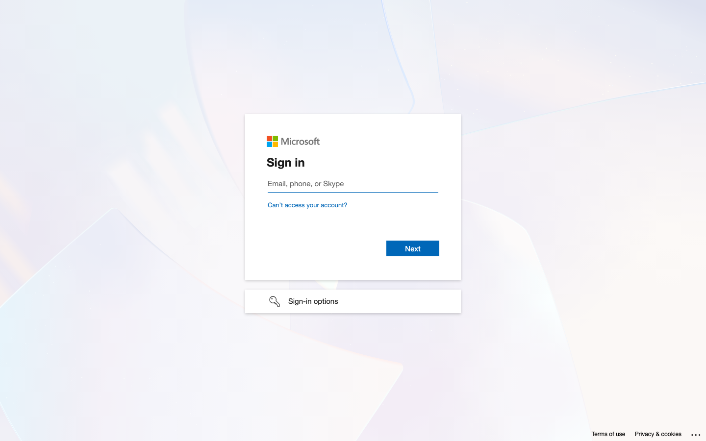

# Helpdesk — Administrator Guide

Configuration reference for **Africa CDC Service Desk** administrators. Pair with the [User Guide](./USER_GUIDE.md) for end-user flows and the [Developer Guide](./DEVELOPER_GUIDE.md) for deployment and API details.

Screenshots for each settings area live in [`screenshots/`](./screenshots/) (regenerate with `npm run docs:screenshots` from the `helpdesk/` folder).

---

## Table of contents

1. [Access & roles](#access--roles)
2. [Settings overview](#settings-overview)
3. [General settings](#general-settings)
4. [AI models & provider](#ai-models--provider)
5. [Agents & support groups](#agents--support-groups)
6. [Issue categories & business units](#issue-categories--business-units)
7. [IT Assets settings](#it-assets-settings)
8. [Jobs (SLA & directory sync)](#jobs-sla--directory-sync)
9. [WhatsApp & Teams integrations](#whatsapp--teams-integrations)
10. [Audit & ISO logging](#audit--iso-logging)
11. [Environment variables (server)](#environment-variables-server)
12. [Mail & branded notifications](#mail--branded-notifications)
13. [Inbound email intake](#inbound-email-intake)
14. [Security checklist](#security-checklist)
15. [Troubleshooting](#troubleshooting)

---

## Access & roles

| Role | Settings access | Notes |
|------|-----------------|-------|
| **Admin** | Full `/settings/*` | Mapped from Staff portal admin group (`HELPDESK_SSO_STAFF_ROLE_IDS_ADMIN`, default `10`) or explicit Helpdesk admin |
| **Agent / Supervisor** | None (except KB if `can_manage_kb`) | Day-to-day queue work only |
| **Requester** | None | Self-service tickets only |

Grant Helpdesk access via Staff permissions **85** (APM), **92** (Finance), or **93** (Helpdesk-only) — see `HELPDESK_SSO_PERMISSION_CODES`.


---

## Settings overview

| Menu item | Path | Purpose |
|-----------|------|---------|
| **General** | `/settings/general` | Branding, requester follow-up, agent divisions, request-form category toggle, **email ticket intake** master switch |
| **AI models & provider** | `/settings/ai` | OpenAI / Gemini / custom LLM, agent routing |
| **Agents & support groups** | `/settings/agents` | Roster, support groups, category routing, permissions, agent disable |
| **Issue categories** | `/settings/categories` | Business units + issue categories |
| **IT Assets** | `/settings/it-assets` | Hardware brands and asset categories (SIM cards, laptops, etc.) |
| **Jobs** | `/settings/jobs` | SLA rules, Staff directory sync, FAQ ingest |
| **WhatsApp & Teams** | `/settings/integrations` | Channel webhooks & credentials |
| **Software requests** | `/settings/software-requests` | Notify groups and review board |
| **Audit & ISO logging** | `/settings/logging` | Audit log viewer, ISO JSON channel status |

Every save writes to `helpdesk_audit_logs` with actor, IP, and change payload.

---

## General settings

**Path:** Settings → General

### Branding

| Field | Description |
|-------|-------------|
| **Primary colour** | Hex colour for buttons and accents (default Africa CDC green `#0d7a3a`) |
| **Secondary / accent gold** | Hex accent (default `#c9a227`) |

Colours apply across the SPA and align with CBP theme variables.

### Requester follow-up (enabled by default)

| Toggle | When ON |
|--------|---------|
| **Allow reopen via comment & email agent** | Requesters on **closed** tickets see a checkbox *“I'm not satisfied — reopen this ticket”*. Posting with it checked reopens the ticket and sends the **assigned agent one email** containing both the comment and a reopen alert. |

Turn **OFF** if you want comments on closed tickets without automatic reopen or agent email.

### Agent onboarding

| Control | Description |
|---------|-------------|
| **Default agent divisions** | Staff whose `division_id` matches become **agents** on SSO (unless portal admin) |
| **Agents from selected divisions** | Search directory staff and **Mark as agent** to pin the role across division moves |
| **Manual division IDs** | Comma-separated fallback when directory list is incomplete |

---

## AI models & provider

**Path:** Settings → AI models & provider


### UI fields

| Field | Description |
|-------|-------------|
| **Provider** | `openai`, `gemini`, or `custom` (OpenAI-compatible API) |
| **API base** | Endpoint root (auto-filled per provider preset) |
| **Model name** | e.g. `gpt-4o-mini`, `gemini-2.0-flash` |
| **AI active** | Enables subject hints and optional triage signals |
| **AI-assisted agent assignment** | For end-user tickets, LLM picks among eligible agents before rule-based fallback |
| **API key** | Stored **encrypted**; leave blank to keep current key |
| **Fallback order** | Comma-separated provider IDs if primary fails |

### Configuration options

**Via Settings UI** (recommended for keys and toggles):

1. Open **Settings → AI models & provider**.
2. Choose provider; paste API key once (encrypted at rest).
3. Enable **AI active** and optionally **AI-assisted agent assignment**.
4. Click **Save AI settings**.

**Via environment** (optional defaults only — keys still via UI):

```env
# No separate AI env keys required; all stored in helpdesk_settings table after first save.
```

### Provider quick reference

| Provider | Typical API base | Key source |
|----------|------------------|------------|
| OpenAI | `https://api.openai.com/v1` | platform.openai.com |
| Gemini | Google AI OpenAI-compatible endpoint | Google AI Studio |
| Custom | Your gateway URL | Your vendor |

### Ask Helpdesk (home search)

Rate-limited endpoint `POST /api/v1/ai/ask` (24 req/min per user) uses the same provider configuration when **AI active** is on.

---

## Agents & support groups

**Path:** Settings → Agents & support groups


### Tabs

| Tab | Purpose |
|-----|---------|
| **Support groups** | Named teams (e.g. Software Development, Infrastructure) with members and inherited categories |
| **Agents** | Per-agent direct categories, group membership, `can_manage_kb`, `can_reassign_tickets` |
| **Permission overrides** | Bulk permission flags |

### Support groups

- Create groups with slug, description, and **issue categories**.
- Add agents as members; routing considers group + direct categories.
- Default groups seeded on migrate: Software Development, Infrastructure Management, Network and Infrastructure, Systems Administration.

### Ticket assignment

Auto-assignment picks a **support group** (when category matches), then a member agent by workload and duty station. Supervisors may **reassign** with a mandatory reason (10+ characters).

Agents can be marked **disabled for routing** so they keep access but are skipped for new auto-assignments (useful for leave or training).

---

## Issue categories & business units

**Path:** Settings → Issue categories



Two tabs:

### Issue categories

- CRUD categories shown when the request form is configured to show categories (see General → show issue category on request form).
- Each category belongs to a **Business Unit** and may include an **AI description** used when email/web tickets are auto-categorized.
- Tie each category to SLA rules under **Jobs**.
- Categories in use cannot be deleted (API returns an error).

### Business units

Business units group categories (IT & MIS, Knowledge Management, HR, Finance, Internal Oversight, …). The table is intentionally lean (name, mailbox, categories, active). Use **Add** / **Edit** to open a **modal** with:

| Field | Purpose |
|-------|---------|
| **Name / slug / description / order / active** | Identity and request-form copy |
| **Allow anonymous reports** | e.g. Internal Oversight |
| **Allow Asset** | Optional IT asset link when resolving tickets for this unit |
| **Support mailbox** | Exchange mailbox for this unit (IT & MIS defaults to `helpdesk@africacdc.org`) |
| **Enable email intake** | Poll that mailbox every minute (see [Inbound email intake](#inbound-email-intake)) |

---

## IT Assets settings

**Path:** Settings → IT Assets

Manage the catalogues used by **Tools → IT Assets**:

| Tab | Purpose |
|-----|---------|
| **Brands** | Dell, Apple, HP, Safaricom, … — shown as a dropdown on the asset form |
| **Categories** | Laptops, SIM cards, printers, accessories, etc., plus default useful life for depreciation |

Staff with IT Assets permission (or Helpdesk admins) maintain inventory under **Tools → IT Assets**: assignee from the **Staff directory**, brand dropdown, filters (category / brand / status / search including serial).

When a Business Unit has **Allow Asset** enabled, agents resolving a ticket can optionally link an asset **assigned to the requester** (search by serial, tag, name, brand, model).

---

## Jobs (SLA & directory sync)

**Path:** Settings → Jobs


### SLA rules

Define per-category **response** and **resolution** targets (minutes). Used by agent desk KPIs, reports, and the public TV screen.

### Staff directory sync

Click **Sync now** (`POST /api/v1/admin/reference-sync`) to refresh divisions, directorates, and staff cache from the Staff Share API.

**Requires** valid `STAFF_API_USERNAME`, `STAFF_API_PASSWORD`, and `BASE_URL` / `STAFF_API_BASE_URL` in `backend/.env` (copy from working `apm/.env`).

### FAQ ingest (APM / external)

Configure JSON export URLs to pull FAQ content into the knowledge base. Managed via the FAQ sources panel on the Jobs page:

| Field | Description |
|-------|-------------|
| **Label** | Display name for the source |
| **URL** | HTTPS export endpoint (APM FAQ export supported) |
| **Format** | `apm_export` or compatible JSON |
| **Category map** | Map remote category slugs to Helpdesk category IDs |
| **Deactivate missing** | Remove KB articles no longer in export |

Run **Ingest now** after saving sources.

---

## WhatsApp & Teams integrations

**Path:** Settings → WhatsApp & Teams


The page shows your **webhook base URL** (from `APP_URL`), typically:

`https://<host>/staff/helpdesk/backend/api/v1/webhooks`

### WhatsApp Cloud API

| Setting | Description |
|---------|-------------|
| **Enable WhatsApp** | Registers webhook endpoints |
| **Phone number ID** | From Meta Business Suite |
| **Verify token** | Shared secret for Meta webhook challenge (`hub.verify_token`) |
| **Permanent access token** | Encrypted; Graph API calls |
| **App secret** | Encrypted; verifies `X-Hub-Signature-256` on inbound POSTs |

**Meta developer console**

| Step | Value |
|------|-------|
| Webhook verify URL (GET) | `{webhook_base}/whatsapp` |
| Webhook events URL (POST) | `{webhook_base}/whatsapp` |
| Verify token | Same string as in Settings |
| Subscribe | `messages` (when ticket creation is enabled) |

Official docs: [WhatsApp Cloud API](https://developers.facebook.com/docs/whatsapp/cloud-api/overview) · [Webhooks](https://developers.facebook.com/docs/whatsapp/cloud-api/webhooks/components)

> Inbound WhatsApp → ticket creation is phased; credentials and signature verification are live.

### Microsoft Teams (Azure Bot)

| Setting | Description |
|---------|-------------|
| **Enable Teams** | Exposes Bot Framework messaging endpoint |
| **Microsoft App ID** | Azure Bot registration |
| **Directory (tenant) ID** | Azure AD tenant |
| **Messaging path** | URL segment after `/teams/` (default `activities`) |
| **Client secret** | Encrypted bot password |

**Azure Bot messaging endpoint:**

`POST {webhook_base}/teams/{messaging_path}`

Example: `https://cbp.africacdc.org/staff/helpdesk/backend/api/v1/webhooks/teams/activities`

Docs: [Azure Bot Service](https://learn.microsoft.com/en-us/azure/bot-service/bot-service-overview-introduction)

---

## Audit & ISO logging

**Path:** Settings → Audit & ISO logging


| Feature | Description |
|---------|-------------|
| **Audit log viewer** | Paginated `helpdesk_audit_logs` (settings changes, admin actions) |
| **ISO JSON channel** | When `LOG_STACK` includes `iso_json`, security events write to `storage/logs/helpdesk-iso.jsonl` |

Enable ISO channel in `backend/.env`:

```env
LOG_STACK=single,iso_json
```

---

## Environment variables (server)

Edit `helpdesk/backend/.env` (or `setup.env` → `configure-env.sh`). Key groups:

### Core / URLs

| Variable | Purpose |
|----------|---------|
| `APP_URL` | API base, e.g. `https://host/staff/helpdesk/backend` |
| `APP_DEBUG` | **Must be `false` in production** |
| `HELPDESK_FRONTEND_URL` | SPA URL for email deep links |
| `HELPDESK_STAFF_PORTAL_URL` | Staff portal root (logo assets, SSO) |
| `HELPDESK_API_PUBLIC_URL` | Absolute API origin for signed avatar/attachment URLs |

### Authentication

| Variable | Purpose |
|----------|---------|
| `JWT_SECRET` | Must match Staff portal — verifies `?token=` SSO |
| `HELPDESK_BRIDGE_SECRET` | HMAC for server-only `POST /auth/exchange` |
| `HELPDESK_SSO_PERMISSION_CODES` | Default `85,92,93` |
| `HELPDESK_SSO_STAFF_ROLE_IDS_ADMIN` | Default `10` |
| `HELPDESK_DEFAULT_AGENT_DIVISION_IDS` | Default `21` |

### Staff Share API (directory)

| Variable | Purpose |
|----------|---------|
| `BASE_URL` / `STAFF_API_BASE_URL` | Staff portal root |
| `STAFF_API_USERNAME` | Share API login email |
| `STAFF_API_PASSWORD` | Share API password |
| `STAFF_API_TOKEN` | Token appended to Share API paths |
| `HELPDESK_REFERENCE_CACHE_TTL` | Cache seconds (default 300) |

### Mail (Microsoft Graph)

| Variable | Purpose |
|----------|---------|
| `MAIL_MAILER` | `exchange` for Graph (same pattern as APM) |
| `MAIL_FROM_ADDRESS` | Sender mailbox |
| `MAIL_FROM_NAME` / `HELPDESK_MAIL_BRAND_NAME` | `Africa CDC Service Desk` |
| `EXCHANGE_TENANT_ID`, `EXCHANGE_CLIENT_ID`, `EXCHANGE_CLIENT_SECRET` | Azure app credentials |
| `EXCHANGE_AUTH_METHOD` | Prefer `client_credentials` |
| `EXCHANGE_SCOPE` | Prefer `https://graph.microsoft.com/.default` |

**Inbound mailbox intake:** See [Inbound email intake](#inbound-email-intake). Requires Graph **Mail.ReadWrite** (or read+move) on each Business Unit mailbox, plus queue workers on `default,helpdesk,helpdesk-ai`.

### Cache / performance

| Variable | Purpose |
|----------|---------|
| `CACHE_STORE` | `redis` recommended in production |
| `REDIS_HOST`, `REDIS_PORT`, `REDIS_PASSWORD` | Redis connection |
| `HELPDESK_TICKET_READ_CACHE_ENABLED` | Ticket list caching |
| `HELPDESK_TICKET_READ_CACHE_TTL` | Cache TTL seconds |

### Security

| Variable | Purpose |
|----------|---------|
| `HELPDESK_AVATAR_SIGNING_SECRET` | Optional; defaults to `APP_KEY` |
| `HELPDESK_ATTACHMENT_SIGNING_SECRET` | Signed attachment download URLs |
| `HELPDESK_ATTACHMENT_SIGNED_TTL` | Link lifetime (default 7 days) |

Full template: [`backend/.env.example`](../backend/.env.example)

---

## Mail & branded notifications

Transactional emails use the **Africa CDC Service Desk** HTML template with logo from `APP_LOGO_URL` / `{staff_portal}/assets/images/AU_CDC_Logo-800.png`.

| Email | Trigger |
|-------|---------|
| Ticket assigned / reassigned | Agent assignment change |
| Ticket closed (resolution) | Agent submits resolution |
| Requester comment (+ reopen) | Requester comments; reopen alert in same email when enabled |

Configure brand name via `HELPDESK_MAIL_BRAND_NAME` or Settings (general branding colours affect SPA only; mail brand is env-driven).

---

## Inbound email intake

### How it works

1. Scheduler runs **every minute** (`PollBusinessUnitMailboxesJob` on the `helpdesk` queue).
2. For each active Business Unit with **email intake** on and a valid **support mailbox**, Graph lists **unread** Inbox messages (up to 25 per run).
3. For each new message (deduped by Graph message id in `helpdesk_email_messages`):
   - Create a ticket with `source=email`, that Business Unit, subject/body from the mail, requester resolved from Staff directory by From: address when possible.
   - Dispatch `CategorizeTicketWithAi` (queue `helpdesk-ai`) to pick a category under the BU and assign an eligible agent.
   - If categorization fails → assign a **helpdesk admin** using least open-ticket workload.
   - Mark the message **read** and **move** it to a mailbox folder named **Processed** (created if missing).

### Admin checklist

1. Grant Graph **Mail.ReadWrite** (application) on each intake mailbox.
2. Confirm `EXCHANGE_*` and `MAIL_FROM_ADDRESS` in `backend/.env`.
3. In **Settings → General**, turn on **Allow email submission of tickets** (master switch; off by default).
4. In Settings → Issue categories → Business units → Edit: set mailbox + enable intake (IT & MIS defaults to `helpdesk@africacdc.org`). Use **Test read** to list unread mail without creating tickets.
5. Ensure `helpdesk-scheduler.timer` and queue worker run (`default,helpdesk,helpdesk-ai` — see [SYSTEMD.md](./SYSTEMD.md)).
6. Watch logs for `helpdesk.email_intake.*` if mail is not turning into tickets.

---

## Security checklist

Production administrators should verify:

- [ ] `APP_DEBUG=false`
- [ ] Strong `APP_KEY`, `JWT_SECRET`, `HELPDESK_BRIDGE_SECRET`
- [ ] `STAFF_API_TOKEN` set (no default token)
- [ ] WhatsApp **app secret** saved (enables webhook signature verification)
- [ ] Rate limits active on auth endpoints (30/min)
- [ ] Attachment downloads use **signed URLs** only (not public `/storage/helpdesk/`)
- [ ] `LOG_STACK` includes `iso_json` for audit evidence
- [ ] Block direct web access to `storage/app/public/helpdesk/` if previously exposed

Run security tests: `php artisan test tests/Feature/SecurityApiTest.php` (requires PHPUnit in `backend/vendor`).

---

## Troubleshooting

| Symptom | Fix |
|---------|-----|
| Email tickets never appear | [Inbound email intake](#inbound-email-intake): Graph permissions, intake toggle, scheduler, queues `helpdesk` / `helpdesk-ai` |
| Directory picker empty | **Settings → Jobs → Sync now**; verify `STAFF_API_*` credentials |
| AI assignment never runs | Enable **AI active** + **AI-assisted agent assignment**; confirm API key on file |
| WhatsApp verify fails | Match verify token in Meta console and Settings; check GET URL |
| WhatsApp POST rejected | Save **app secret**; Meta must send `X-Hub-Signature-256` |
| Teams bot 404 | Confirm messaging URL matches `{base}/teams/{path}` |
| Emails show old “API” name | Set `HELPDESK_MAIL_BRAND_NAME` and `php artisan config:clear` |
| Agent not notified on reopen | Enable **Requester follow-up** in General settings |

---

See also: [INTEGRATION.md](./INTEGRATION.md) · [SYSTEMD.md](./SYSTEMD.md) · [USER_GUIDE.md](./USER_GUIDE.md)
