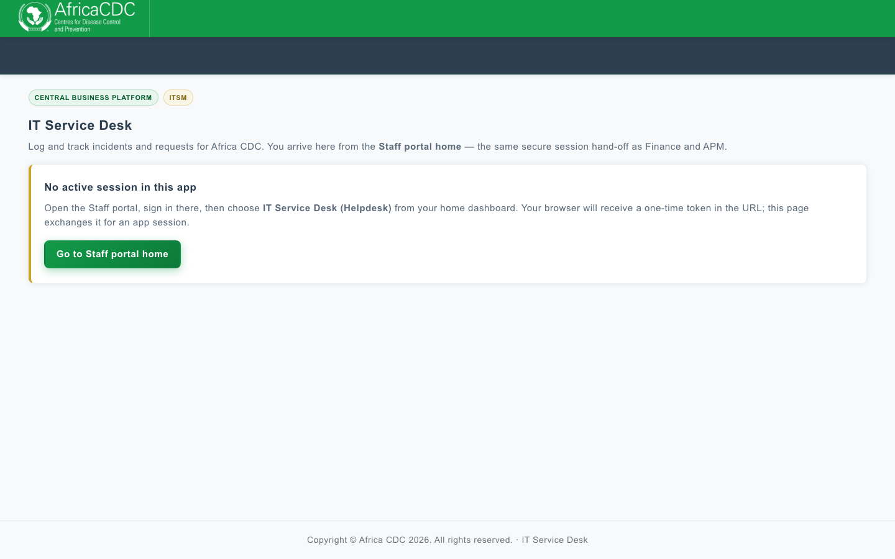
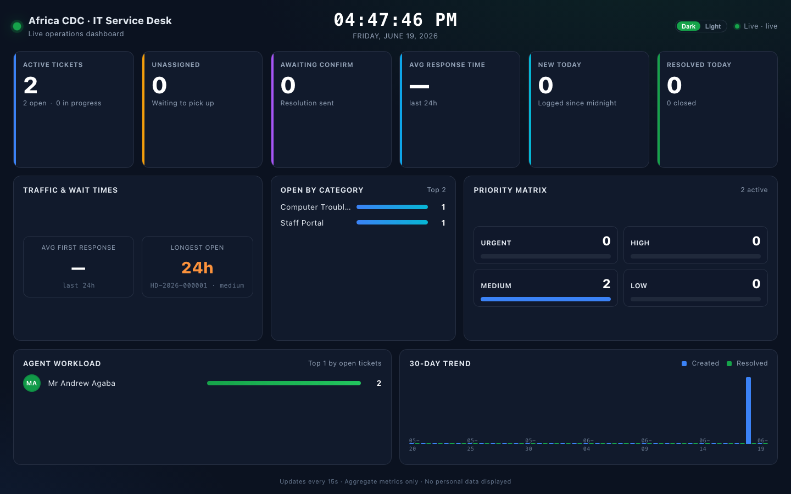

# Helpdesk — User Guide

Welcome to the **Africa CDC Service Desk**. This guide walks every audience through what they can do in the helpdesk SPA, including step-by-step **creating a ticket**, **reopening closed tickets**, and **agent desk** workflows.

> The helpdesk is reached from the Staff portal home page (the **Service Desk** tile). You will be signed in automatically — there is no separate password.

## Table of contents

1. [Audiences](#audiences)
2. [Getting in](#getting-in)
3. [The home page](#the-home-page)
4. [Creating a ticket](#creating-a-ticket) ← step-by-step
5. [Tracking your tickets (requesters)](#tracking-your-tickets-requesters)
6. [Comments, reopen & agent email](#comments-reopen--agent-email)
7. [Agent desk](#agent-desk-agents--supervisors)
8. [Resolving a ticket (agents)](#resolving-a-ticket-agents)
9. [Support groups](#support-groups)
10. [Reassigning a ticket](#reassigning-a-ticket-permission-required)
11. [Tools (IT Assets & software)](#tools-it-assets--software)
12. [Knowledge base](#knowledge-base)
13. [Reports](#reports)
14. [TV / lobby dashboard](#tv--lobby-dashboard)
15. [Admin settings](#admin-settings-administrators)
16. [Troubleshooting](#troubleshooting)

> **Administrators:** see the dedicated [Administrator Guide](./ADMIN_GUIDE.md) for AI, WhatsApp, Teams, mail, env vars, and security configuration.

---

## Audiences

The helpdesk recognises five roles. Each user gets exactly one, set automatically the first time they sign in (admins can refine it later).

| Role | Who | What they can do |
|---|---|---|
| **Requester** (`user`) | Default for every staff member | File tickets, view their own tickets, comment, confirm resolutions, browse the knowledge base. |
| **Agent** | Members of designated agent divisions or staff explicitly marked by an admin | Everything a requester can, plus: see all tickets in their queue, change status/priority, add internal notes, attach files, submit resolutions. |
| **Supervisor** | Senior agents | Same actions as agents (used for reporting splits and category routing). |
| **Admin** | Helpdesk owners (mapped from Staff portal role groups) | Full access: settings, categories, SLA rules, agents, knowledge base, audit log. |
| **Auditor** | Compliance / read-only staff | Read access to tickets and reports without write permissions. |

Two granular flags live on top of the agent role and can be toggled by admins from **Settings → Agents**:

- **`can_manage_kb`** — lets a non-admin create / edit knowledge-base articles.
- **`can_reassign_tickets`** — lets an agent hand a ticket over to a different agent (with a reason).

Agents may belong to **support groups** (e.g. Software Development, Infrastructure). Groups inherit issue categories and participate in automatic routing — see [Support groups](#support-groups).

---

## Getting in

1. Sign in to the **Staff portal** (`/staff/`) as usual.
2. On the home page, look for the **Service Desk** tile and click it.
3. You'll land on the helpdesk SPA at `/staff/helpdesk/` already signed in. Your name and role appear in the top bar.

If you ever see _"helpdesk_error=sso"_ on the portal home, your account does not currently have the helpdesk permission. Ask an administrator to grant Staff permission **85**, **92**, or **93** (the codes recognised by `HELPDESK_SSO_PERMISSION_CODES`).

---

## The home page

The helpdesk home page combines two things:

- **A searchable knowledge base** browser, grouped by category. Type a question — the matching FAQs filter live.
- **Quick links** — depending on your role, you'll see shortcuts to *Create ticket*, *My tickets*, *Agent desk*, *Knowledge base management*, *Reports*, and *Settings*.

You can return to the home page any time by clicking the **Service Desk** logo in the top-left.

---

## Creating a ticket

You can open this flow from:

- The **+ New ticket** button on the **My tickets** page (`/tickets`),
- The **Create ticket** card on the home page, or
- Directly at `/tickets/new`.

### Who you can file for

- **As a requester** — you can file a ticket for yourself, or, if you know the staff ID of a colleague, choose them as the requester (helpful when you log an issue someone reported to you in person).
- **As an agent / supervisor / admin** — you **must** select a requester from the Staff directory before saving. The picker searches `name`, `work email`, and `staff id` against the Staff portal directory in real time. The form sets a `agent_logged_for_requester` flag automatically so reports can tell agent-logged tickets apart from self-service.

### Step-by-step

1. **Open the form** at `/tickets/new`. You'll see tabs for a **Helpdesk ticket** (default) and a gateway to **Software request** when you have permission.

2. **Requester** *(agents only)*
   - Start typing a name or work email. The directory dropdown filters as you type (debounced).
   - Click the matching person. Their directorate, division, and duty station load read-only beneath the picker so you know who you're filing for.
   - Requesters skip this step — you are the requester by default. If you want to log on behalf of someone else, expand the **"Log this on behalf of someone else"** toggle and pick them.

3. **Business unit** *(required)*
   - Choose the unit that should handle the issue (e.g. **IT & MIS**, Knowledge Management, HR, Finance, Internal Oversight). Each unit shows a short description to help you pick.
   - **Internal Oversight** may allow **anonymous** reporting (no personal details stored) when that option is enabled for the unit.

4. **Category** *(only if admins turned on “show issue category on request form”)*
   - When that setting is **off** (default), you pick a Business Unit only; the system **AI-categorizes** the ticket in the background and assigns an agent.
   - When that setting is **on**, pick Business Unit first, then the matching issue category (Email, Computer troubleshooting, Network, Access, Printing, etc.).

5. **Priority** *(agents only — requesters cannot set priority)*
   - `low` / `medium` / `high` / `critical`.
   - Requester-submitted tickets default to **medium** (or the category/matrix rule) after triage.

6. **Description** *(strongly recommended)*
   - The description field is a **rich text editor** (Quill). You can paste screenshots from your clipboard, format bullet lists, add links, and use code blocks.
   - There is no separate "subject" field — the system writes the subject for you using your category or business unit + name + the first line of your description.

7. **Attachments** *(optional)*
   - Drag files into the upload zone or click to pick. One file at a time, up to **10 MB**.
   - Allowed types: **JPG, JPEG, PNG, GIF, WEBP, PDF, DOC, DOCX**.

8. **Submit**
   - Click **"Create ticket"**. You get a number like **`HD-2026-000123`**.
   - Assignment: category routing when a category is known; otherwise AI categorize then assign (or helpdesk admins by workload if categorization fails).

### Email to the service desk

If your Business Unit has **email intake** enabled (IT & MIS uses `helpdesk@africacdc.org`), messages sent to that mailbox become tickets automatically (`source=email`), are categorized, and assigned like web tickets. You do not need to use the form for those requests.

### What happens next

- An entry is written to the ticket's **audit history** (always visible in the timeline).
- If the assignee has notifications enabled (mail / Teams), they're alerted immediately.
- You'll receive an **email** with the ticket number and a tracking link when configured.

### Tips

- **Filing for a colleague?** Use the requester picker — don't impersonate (sign-in is single sign-on, so tickets are always traceable to you in the history log).
- **Multiple attachments?** Upload them one at a time; the form accepts as many as the ticket needs.
- **Need to add information later?** Open the ticket and use the **Comment** box — every reply (public or internal) is timestamped and attributed.

---

## Tracking your tickets (requesters)

Click **My tickets** in the top bar (or visit `/tickets`).

You'll see:

- Your full list, newest first, with status, priority, category, assignee, and created date.
- A search box that filters by ticket number, subject, and category.
- Status filters (`open`, `pending`, `in progress`, `awaiting confirm`, `resolved`, `closed`).

Open any ticket to see:

- The full description, attachments, comments, and resolution.
- A live **timeline** of every event (created, assigned, status change, comment, resolution submitted, resolution confirmed, reassignment).
- A **comment box** — your replies are sent to the assignee and the watchers.

You cannot change priority, category, status, or the assignee yourself — those belong to the agent.

---

## Comments, reopen & agent email

When an agent **closes** your ticket, you receive a branded email from **Africa CDC Service Desk** with resolution notes and a link back to the ticket.

On a **closed**, **resolved**, or **awaiting confirmation** ticket:

1. Scroll to **Comments** on the ticket detail page.
2. Describe what is still wrong.
3. If **Requester follow-up** is enabled in settings (default **on**), check **“I'm not satisfied — reopen this ticket”**.
4. Click **Post & reopen**.

Your assigned agent receives **one email** containing your comment and a clear **reopened** alert. The ticket returns to **open** status.

If you only need to add information without reopening, uncheck the box and click **Post comment** — the agent is still emailed when follow-up is enabled.

> Administrators can disable reopen-via-comment and agent email under **Settings → General → Requester follow-up**. See [ADMIN_GUIDE.md](./ADMIN_GUIDE.md).

---

## Agent desk (agents & supervisors)

The **Agent desk** at `/desk/agent` is the daily workspace for everyone with a staff role.

What you see:

- A greeting with your **full name** and the current date.
- **KPI tiles** (clickable — filter the recent-tickets table and scroll to it): *Pending*, *Due today*, *Overdue*, *Awaiting confirmation*, *High-priority*, *Resolved*, and more.
- **Status / priority charts** and a live **recent tickets** table with quick filters.
- An embedded **kanban** board for drag-and-drop status moves (including resolve).
- **Action buttons** per ticket: *Open*, *Reassign* (if permitted).

The data refreshes when you switch tabs and on each visit; click any KPI tile to filter the list below.

---

## Resolving a ticket (agents)

From the ticket detail page or the agent desk resolve flow:

1. Write **resolution notes** in the rich text editor (screenshots and formatting supported).
2. Confirm resolve. Optionally **publish to the knowledge base** if you have permission.
3. If the ticket’s Business Unit has **Allow Asset** enabled, you may optionally **link an IT asset** assigned to the requester — search by **serial number**, asset tag, name, brand, or model.
4. The requester is emailed; they can close the ticket when satisfied or reopen if needed.

---

## Support groups

Support groups bundle agents who handle related issue categories (for example **Network and Infrastructure** or **Software Development**).

- Admins manage groups under **Settings → Agents & support groups → Support groups**.
- Each group has members and **inherited categories** used for routing.
- Tickets may show an assigned **group** as well as an individual agent.
- When reassigning, eligible agents respect group and category rules.

---

## Reassigning a ticket (permission required)

Only agents with `can_reassign_tickets = true` (admins always qualify) see the **Reassign** button on a ticket.

### Where it appears

- Inline on each row of the **Agent desk** recent-tickets table (only on rows whose status is `open`, `pending`, or `in_progress`).
- On the ticket detail page header.

### Steps

1. Click **Reassign**.
2. A modal opens with the **list of eligible agents** for the ticket's category (loaded via `GET /tickets/{id}/eligible-agents`). Each row shows the agent's name and current open ticket count, so you can prefer a less-busy colleague.
3. Pick the new assignee.
4. Enter a **reason** (minimum 10 characters — required). The reason is logged so the audit trail is clear ("Out of office", "Specialist needed", etc.).
5. Click **Confirm reassign**.

What happens:

- The ticket's `assigned_user_id` is updated.
- A row is added to the ticket history (`reassigned` event) with the reason and the original assignee.
- An **internal comment** with the same reason is recorded so the new agent has context.
- The new assignee receives a notification.

Reassignment is **only** allowed on `open`, `pending`, or `in_progress` tickets — the API rejects attempts on `awaiting_requester_confirmation`, `resolved`, or `closed` tickets with a clear 422 error.

---

## Tools (IT Assets & software)

Staff with the right permissions see **Tools** in navigation:

| Tool | What it does |
|------|----------------|
| **IT Assets** | Inventory with depreciation: assign staff from the directory, choose brand/category, search by serial/tag/assignee. Brands and categories are managed under **Settings → IT Assets**. |
| **Licenses** | Software license tracking with responsible person from the directory. |
| **Software requests** | Submit/approve software needs (rich text problem / solution / justification). |

---

## Knowledge base

### Browsing (everyone)

The home page lists FAQs grouped by category with a global search box. Click any question to expand the full answer. Articles are reordered by the `sort_order` field and only **active** articles appear.

### Managing (admins + `can_manage_kb` agents)

If you have permission, **"Knowledge base"** appears in the top navigation. Open it at `/knowledge-base/manage` to:

- **Add** an article: pick category, type a question, write the answer (rich text), set sort order, mark active.
- **Edit** an article inline.
- **Reorder** within a category by adjusting sort order.
- **Deactivate** instead of deleting — deactivated articles disappear from the public list but stay in the database for audit.

Use the knowledge base to deflect repeat tickets. The home-page search runs over titles and answers, so phrase answers the way users would search ("how do I reset my password", not "AD password reset procedure").

---

## Reports

`/reports` shows two tabs:

- **My tickets** — your own activity:
  - As a *requester*: tickets you've filed, with totals (pending/resolved/total received).
  - As an *agent*: your queue and resolution history.
- **Admin summary** *(admins only)*: org-wide counts (total / open / awaiting confirm / resolved / closed) and the 30 most recent tickets.

The **Export** button on each tab streams an Excel workbook (`maatwebsite/excel`) with the matching scope.

---

## TV / lobby dashboard

A public, full-screen dashboard for office TVs lives at **`/staff/helpdesk/screen`**. It does **not** require authentication and exposes only aggregate metrics — never ticket subjects, descriptions, or requester identities.

What it shows:

- **Live clock + status pip** ("Live" / "Reconnecting").
- **KPI tiles**: Active tickets, Unassigned, Awaiting confirm, SLA breached, New today, Resolved today.
- **SLA gauges**: % first-response within target, % resolution within target (rolling 7 days).
- **Traffic & wait times**: average first-response, longest open ticket (with number + priority, but no subject).
- **Priority matrix**: count by Urgent / High / Medium / Low.
- **Agent workload**: top 8 agents by current open load.
- **Open by category**: top 8 categories by open count.
- **30-day trend**: created vs resolved per day.

The page polls every 15 seconds and tolerates short network blips (it shows "Reconnecting" rather than blanking out).

Point a TV browser at the screen URL once and leave it — no sign-in required.

---

## Admin settings (administrators)

The **Settings** area (`/settings`) is gated to `role = admin`. Use the **[Administrator Guide](./ADMIN_GUIDE.md)** for full configuration steps (AI, WhatsApp, Teams, env vars, security).

| Panel | Path | Summary |
|-------|------|---------|
| **General** | `/settings/general` | Branding, requester follow-up, request-form category toggle, agent divisions |
| **AI models & provider** | `/settings/ai` | OpenAI / Gemini / custom, encrypted API key, AI assignment |
| **Agents & support groups** | `/settings/agents` | Groups, roster, categories, permissions, routing disable |
| **Issue categories** | `/settings/categories` | Business units (mailbox, Allow Asset, email intake) + categories |
| **IT Assets** | `/settings/it-assets` | Brands and hardware categories |
| **Jobs** | `/settings/jobs` | SLA rules, directory sync, FAQ ingest |
| **WhatsApp & Teams** | `/settings/integrations` | Webhook URLs and encrypted credentials |
| **Software requests** | `/settings/software-requests` | Notify groups and review board |
| **Audit & ISO logging** | `/settings/logging` | Audit viewer, ISO JSON log status |

Every settings save writes an entry to the audit log with the actor, IP, user-agent, and a JSON diff.

**Regenerate screenshots:** `npm run docs:screenshots` from the `helpdesk/` folder (see [screenshots/README.md](./screenshots/README.md)).

---

## Troubleshooting

| Symptom | Likely cause / fix |
|---|---|
| `helpdesk_error=sso` on the Staff portal | Your account doesn't have permission 85, 92, or 93. Ask an admin. |
| "Could not load staff from the directory" when filing a ticket | The Staff Share API credentials are stale. An admin should open **Settings → Jobs** and click **Sync now** (`POST /admin/reference-sync`). |
| Attachment upload fails | Check the file is under 10 MB and is a supported MIME (`jpg/jpeg/png/gif/webp/pdf/doc/docx`). Network firewalls also block some MIMEs — try a PDF. |
| You can't see the **Reassign** button | Either the ticket isn't in `open` / `pending` / `in_progress`, or you don't have `can_reassign_tickets`. Admins set this on **Settings → Agents**. |
| Resolution email never arrives | Check `MAIL_*` / Exchange Graph vars; see [ADMIN_GUIDE → Mail](./ADMIN_GUIDE.md#mail--branded-notifications). |
| Email to helpdesk never becomes a ticket | Admin must enable intake on the Business Unit mailbox and Graph Mail.ReadWrite; see [ADMIN_GUIDE → Inbound email intake](./ADMIN_GUIDE.md#inbound-email-intake). |
| Cannot link an asset on resolve | Business Unit needs **Allow Asset**; asset must be assigned to the ticket requester in IT Assets. |
| Reopen checkbox missing | **Settings → General → Requester follow-up** may be off, or ticket is not closed. |
| Agent not emailed on comment | Same toggle; ticket must have an assigned agent with a valid email. |
| The TV screen says "Reconnecting" indefinitely | The browser can't reach `/api/v1/public/screen`. Confirm Apache is up and `throttle:120,1` isn't being hit by another consumer. |

---

For technical deep-dives (schema, endpoints, extension points) see the [Helpdesk Developer Guide](./DEVELOPER_GUIDE.md).
